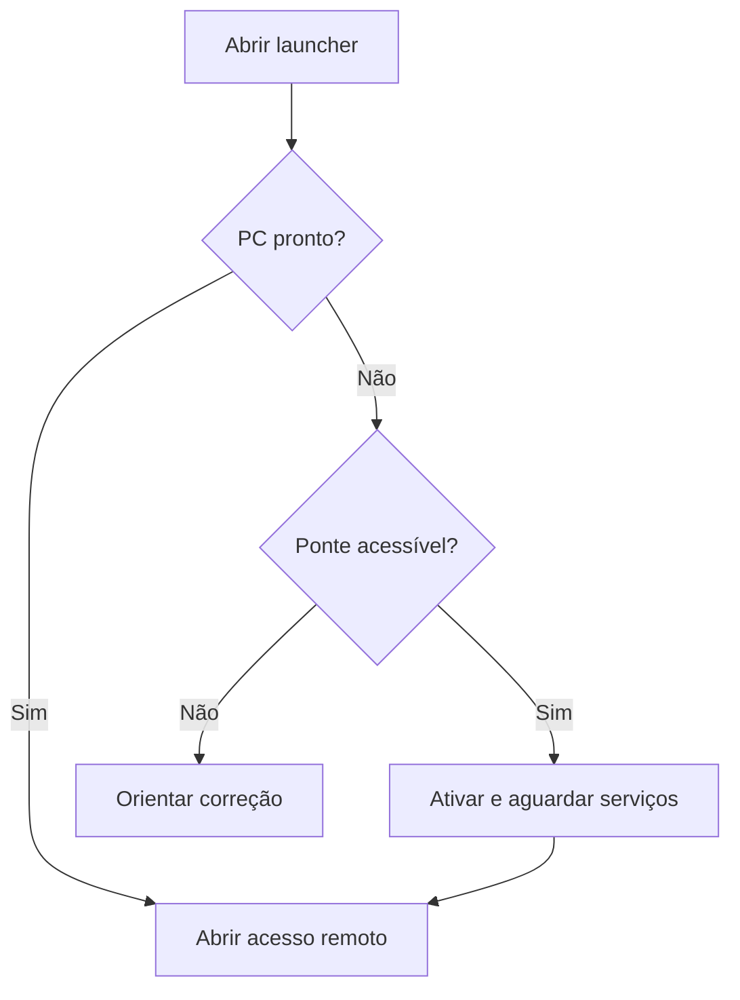

# Visão do produto

## Controle

| Campo | Valor |
| --- | --- |
| Versão | 1.0.0 |
| Estado | Aprovado |
| Data | 14/07/2026 |
| Derivado de | 00-briefing.md |

## Visão

Para pessoas que precisam acessar um computador Windows localizado em outra rede, o Remote Wake Assistant é um assistente local de ativação e conexão que transforma uma sequência técnica de rede, autenticação e Wake-on-LAN em uma ação visual, acompanhada e segura. Diferentemente de scripts isolados, ele diagnostica a configuração, distingue os estados da cadeia e somente abre o acesso remoto quando o serviço estiver pronto.

## Problema

A ativação remota exige hoje conhecimento de MAC, VPN, SSH, firmware, energia e comandos. Isso exclui usuários comuns, dificulta suporte e favorece configurações inseguras ou irreversíveis.

## Proposta de valor

* Operação diária por um único botão.
* Configuração assistida por evidências e teste real.
* Mensagens compreensíveis e diagnóstico por etapa.
* Segurança por padrão, credenciais individuais e revogação.
* Funcionamento local-first, sem backend próprio no MVP.
* Integração extensível com aplicações remotas.

## Objetivos

| ID | Objetivo | Indicador de resultado |
| --- | --- | --- |
| OBJ001 | Permitir ativação e conexão sem terminal. | 100% do fluxo comum executável pela interface. |
| OBJ002 | Reduzir a configuração manual. | MAC, adaptador e estados do Windows detectados automaticamente em ≥95% dos ambientes suportados. |
| OBJ003 | Evitar falsos diagnósticos. | 100% das classificações “validado” sustentadas por teste real registrado. |
| OBJ004 | Diferenciar falhas. | 100% dos erros críticos classificados por camada: VPN, ponte, WoL, Windows ou app remoto. |
| OBJ005 | Proteger dispositivos e segredos. | Nenhum segredo em texto puro; toda credencial individualmente revogável. |
| OBJ006 | Manter alterações reversíveis. | 100% das alterações gerenciadas com snapshot anterior e resultado de rollback. |
| OBJ007 | Viabilizar implementação pequena. | MVP entregue pelos marcos definidos, sem backend próprio e com uma integração remota. |

## Não objetivos do MVP

* Substituir RustDesk, AnyDesk, Moonlight, Sunshine ou RDP.
* Suportar Wi-Fi Wake-on-Wireless-LAN.
* Configurar BIOS/UEFI automaticamente.
* Operar como plataforma multiempresa ou serviço em nuvem.
* Oferecer shell remoto, gerenciamento geral do Android ou controle remoto próprio.
* Garantir ativação em hardware não validado.
* Suportar múltiplos computadores e pontes por perfil no MVP.

## Públicos

Usuário comum, técnico instalador, usuário avançado e suporte, detalhados em 02-personas.md.

## Diferenciais

1. Cadeia completa de ativação e abertura, não apenas envio de pacote.
2. Classificação explícita entre detecção, inferência e validação.
3. Configuração reversível e auditável.
4. Bridge Android com comando mínimo e credenciais exclusivas.
5. Interface progressiva: estado essencial primeiro; detalhes técnicos sob demanda.

## Jornada resumida

## Indicadores de sucesso do MVP

| Indicador | Meta |
| --- | --- |
| Taxa de sucesso em ambientes homologados | ≥95% em 30 execuções consecutivas |
| Tempo de decisão de estado inicial | p95 ≤5 s |
| Tempo adicional após serviço pronto até abertura | p95 ≤3 s |
| Operações comuns que exigem terminal | 0 |
| Segredos presentes em exportação de diagnóstico | 0 |
| Cenários críticos automatizados | 100% dos CT críticos |
| Taxa de rollback das alterações gerenciadas | 100% nos ambientes de teste |

## Evolução

* Fase 1: prova técnica da cadeia Notebook → VPN → Android → Magic Packet → PC.
* Fase 2: launcher e diagnóstico Windows.
* Fase 3: configurador seguro, pareamento e empacotamento.
* Pós-MVP: bridge Android nativa, múltiplos computadores, mais aplicações remotas e internacionalização.

## Decisões de produto

* Nome “Remote Wake Assistant” permanece provisório sem bloquear desenvolvimento.
* O MVP é de uso pessoal ou pequeno ambiente administrado; gestão corporativa ampla fica fora.
* Português do Brasil é o idioma inicial.
* Windows 11 x64 é a plataforma preferencial. Windows 10 x64 será aceito apenas quando ainda receber atualizações de segurança aplicáveis, com aviso de ciclo de vida.

## Rastreabilidade

OBJ001–OBJ007 originam RF001–RF030, RNF001–RNF022 e RN001–RN020.
