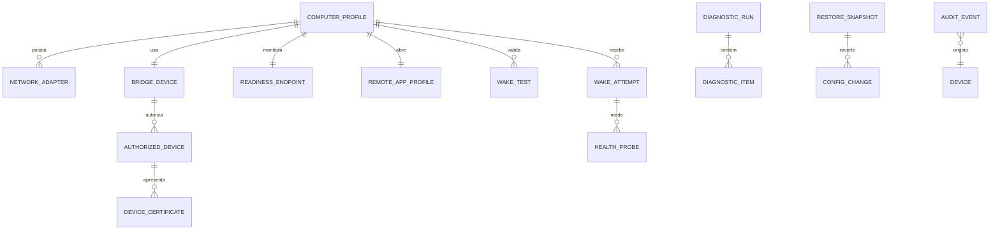

# Modelagem de dados

## Controle

Versão 1.1.0 — Estado: Aprovado — Data: 14/07/2026.

## Decisão

O MVP usa SQLite local para dados relacionais e histórico, DPAPI/Credential Manager e Windows Certificate Store para material secreto ou referências e JSON somente para configuração bootstrap assinada e exportação sanitizada. Chaves privadas e tokens não são colunas do banco.

## Diagrama lógico

## Entidades

| Entidade | Campos principais | Restrições e retenção |
| --- | --- | --- |
| ComputerProfile | id UUID, display_name, bridge_id, readiness_endpoint_id, adapter_id, remote_app_id, compatibility_status, created_at, version | Um ativo no MVP; display_name 1–80; sem segredo |
| NetworkAdapter | id, computer_id, interface_guid, type, physical, mac_encrypted_ref, broadcast, driver_name/version | MAC protegido/mascarado; virtual não elegível |
| BridgeDevice | id, display_name, tailscale_dns_name, tailscale_ip, host_key_fingerprint, health_status, last_seen | IP não é credencial; host fingerprint imutável sem novo pareamento |
| AuthorizedDevice | id, bridge_id, public_key_fingerprint, client_cert_fingerprint, label, status, paired_at, revoked_at, last_used | Uma identidade por notebook; somente material público/referência |
| ReadinessEndpoint | id, computer_id, tailscale_ip, port, server_cert_fingerprint, protocol_version, status | Porta 49152–65535; IP atual validado; sem chave privada |
| DeviceCertificate | id, authorized_device_id, purpose, fingerprint_sha256, not_before, not_after, status, rotated_from_id | Metadados públicos; privada permanece no Certificate Store |
| SecretReference | id, owner_type/id, provider, reference_name, created_at | Aponta para DPAPI/Credential Manager/Certificate Store; nunca contém segredo |
| RemoteApplicationProfile | id, kind, canonical_path, file_hash, probe_kind, probe_value, argument_template_version | Argumentos tipados; histórico de versão |
| DiagnosticRun | id, computer_id, started/ended, overall_status, tool_version, correlation_id | Histórico preservado até exclusão explícita |
| DiagnosticItem | id, run_id, category, source, result, confidence, evidence_json_sanitized | confidence: detected/inferred/tested; sem output bruto secreto |
| WakeTest | id, computer_id, power_state, result, durations_json, evidence_ref, tested_at | Somente sucesso integral autoriza validado |
| WakeAttempt | id, computer_id, request_id, nonce_hash, status, started/ended, receipt_status, correlation_id | Nonce só em hash; retenção 30 dias |
| HealthProbe | id, attempt_id, phase, probe_kind, result, latency_ms, observed_at | Sem payload sensível |
| RestoreSnapshot | id, created_at, hash, status, tool_version | Conteúdo de valores sensíveis referenciado/protegido |
| ConfigurationChange | id, snapshot_id, operation_type, target, previous_ref, desired_ref, applied/verified | Operação da allowlist |
| AuditEvent | id, utc_time, level, code, component, event_name, correlation_id, device_id, properties_json | Rotação/expurgo 30 dias; propriedades sanitizadas |
| SoftwareVersion | component, semantic_version, schema_version, channel, installed_at | Compatibilidade entre componentes |
| InstallationRecord | id, component, package_version, path, installed_at, rollback_ref | Inventário para update/uninstall |
| PairingSession | id, code_hash, expires_at, consumed_at, state | TTL 10 min; nunca código em claro após uso |
| ExportArtifact | id, created_at, categories, file_hash, destination_hint, status | Não guarda caminho completo em logs |

## Enumerações

* CompatibilityStatus: validated, probable, incompatible, inconclusive, incomplete.
* DeviceStatus: active, revoked, pending_revocation.
* CertificateStatus: active, overlap, revoked, expired.
* WakeStatus: created, accepted, packet_sent, waiting, windows_ready, service_ready, opened, cancelled, failed.
* HealthPhase: local_vpn, bridge_node, bridge_wrapper, pc_network, windows_agent, remote_service.
* Confidence: detected, inferred, tested.

## Integridade

* UUID v4/v7; timestamps UTC ISO-8601.
* Foreign keys e WAL habilitados; transações para pareamento, alteração, revogação e migração.
* Migrações forward versionadas e backup antes de atualização.
* Constraints impedem perfil operacional sem bridge, adapter e app.
* Soft delete somente onde auditoria exige; segredos removidos fisicamente na revogação.
* Concorrência otimista por coluna version.

## Proteção

Banco e arquivos em diretório por usuário com ACL; dados que revelam MAC completo usam proteção vinculada ao usuário. Chaves privadas X.509 são não exportáveis: a do serviço fica em `LocalMachine\\My` com ACL exclusiva do SID do serviço e a do launcher no repositório do usuário. Exportação passa por DTO próprio, mascaramento e scanner de segredo. Não serializar entidades diretamente.

## Backup e corrupção

Na abertura: verificar schema e quick_check. Corrupção gera modo somente leitura, preserva arquivo, tenta último backup íntegro e nunca recria silenciosamente.
