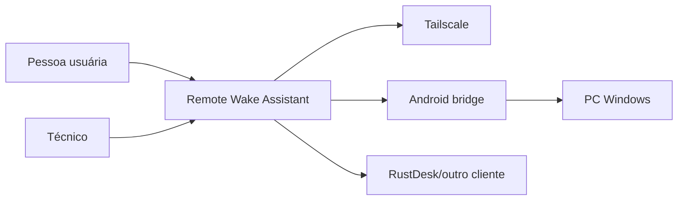
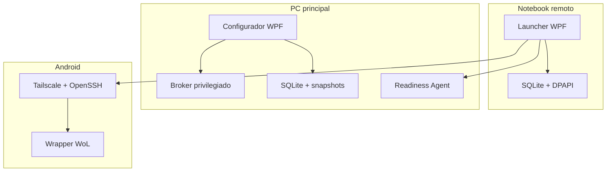
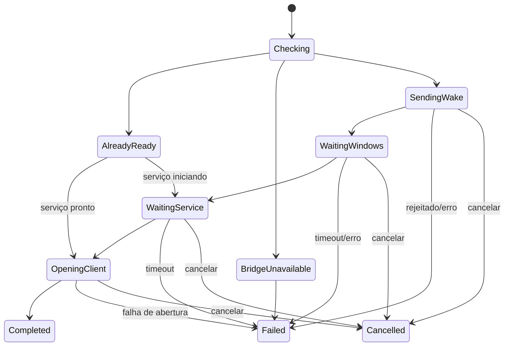

# Arquitetura

## Controle

Versão 1.1.1 — Estado: Aprovado — Data: 14/07/2026.

## Contexto e drivers

A arquitetura deve ocultar a cadeia técnica, operar localmente, integrar-se profundamente ao Windows, limitar privilégios, sobreviver a falhas parciais, preservar rastreabilidade e permitir substituir VPN, bridge e aplicativo remoto.

Drivers: RNF001, RNF005, RNF007–RNF012, RNF017–RNF021; restrição de equipe pequena; um perfil no MVP; nenhum backend próprio.

## Contexto C4



## Contêineres



## Componentes

| ID | Componente | Responsabilidade | Justificativa |
| --- | --- | --- | --- |
| CMP001 | Presentation.Desktop | WPF, navegação, acessibilidade, view models | Separa experiência de domínio |
| CMP002 | Application | Casos de uso, validação e transações | Orquestra sem depender de infraestrutura |
| CMP003 | WakeOrchestrator | Máquina de estados, timeouts, backoff e cancelamento | Distingue camadas e evita sleeps fixos |
| CMP004 | Domain | Entidades, regras, estados e erros | Núcleo testável e estável |
| CMP005 | PrivilegedBroker | Allowlist de mutações Windows via IPC tipado | Menor privilégio |
| CMP006 | WindowsDiagnostics | APIs Windows, WMI/CIM quando necessário e powercfg controlado | Diagnóstico substituível |
| CMP007 | ReadinessAgent | Health autenticado do Windows/serviço remoto | Ping não prova prontidão |
| CMP008 | Persistence | SQLite, Unit of Work e migrações | Consistência local |
| CMP009 | RestoreEngine | Snapshot, diff, aplicação inversa e verificação | Rollback idempotente |
| CMP010 | SecretVault | DPAPI/Credential Manager, fingerprints e ciclo de vida | Segredos fora do banco |
| CMP011 | Observability | logs, catálogo ERR, sanitização e exportação | Suporte sem vazamento |
| CMP012 | VpnAdapter | Estado Tailscale e resolução do node | Evita acoplamento ao fornecedor |
| CMP013 | BridgeAdapter | SSH pinned, protocolo request/response e bootstrap | Comando mínimo no Android |
| CMP014 | RemoteAppAdapter | RustDesk/custom, health e abertura segura | Extensão para outros clientes |
| CMP015 | InstallerUpdater | instalação, versões, integridade, rollback e uninstall | Ciclo de vida seguro |

## Limites de confiança

1. UI→Application: entrada não confiável; validar formato e permissão.
2. UI/Application→Broker: limite privilegiado; named pipe com ACL, identidade do chamador, mensagens tipadas e nonce.
3. Launcher→Tailscale: conectividade externa; estado pode estar obsoleto.
4. Launcher→Bridge: rede hostil mesmo dentro da VPN; SSH pinned e chave individual.
5. Bridge→LAN: broadcast local; target vem de allowlist local, nunca do comando bruto.
6. Launcher→Executável remoto: arquivo externo; validar caminho, hash/assinatura e argumentos.
7. Exportação→Suporte: saída do limite local; consentimento e sanitização.

## Comunicação

| Origem→Destino | Canal | Autenticação | Timeout/retry |
| --- | --- | --- | --- |
| UI→Application | chamada in-process | sessão Windows/perfil | cancelável |
| Application→Broker | named pipe local | ACL + identidade + protocolo | 10 s; sem retry cego |
| Launcher→Bridge | SSH sobre Tailscale | Ed25519 + host pinning | connect 5 s; comando 10 s |
| Bridge→LAN | UDP Magic Packet | autorização antes do envio | burst 3; um retry após 15 s |
| Launcher→Agent | HTTPS/1.1 JSON via Kestrel no IPv4 Tailscale | mTLS; certificados ECDSA P-256 fixados por fingerprint | 5 s; backoff 1/2/4/8/10 s |
| Launcher→App | CreateProcess | validação local | uma tentativa; erro explícito |

## Protocolo do ReadinessAgent

ADR-010 define `POST /rwa/v1/readiness`, payload fechado de até 16 KiB e estados `starting`, `ready`, `notReady`, `notInstalled`, `degraded` e `unknown`. Pedido e resposta contêm versão, request ID, computer ID, timestamp e nonce ecoado. O agente não possui endpoint administrativo.

O configurador escolhe uma porta livre entre 49152 e 65535 e cria regra de firewall limitada ao executável, TCP, endereço local Tailscale e endereço remoto do notebook pareado. O agente somente escuta após obter o endereço da tailnet.

Certificados autoassinados ECDSA P-256 são gerados em cada dispositivo; somente certificados públicos/fingerprints são trocados. Kestrel exige certificado cliente e ambas as pontas validam o pin exato, validade, finalidade e estado de revogação. Chaves privadas são não exportáveis. Validade: 365 dias; rotação inicia 30 dias antes, com sobreposição máxima de 7 dias.

## Máquina de estados



Invariantes: Completed exige LaunchResult bem-sucedido; SendingWake exige PC não pronto e bridge saudável; um recibo não muda o PC para pronto; Cancelled é terminal e cancelamento bloqueia novos retries.

## Persistência

SQLite por instalação/perfil; transações em pareamento, revogação e configuração; segredos no cofre; snapshots com integridade; logs em JSON Lines rotacionado. O domínio não referencia classes SQLite/DPAPI.

## Privilégios

* Launcher/configurador: usuário padrão.
* ReadinessAgent: LocalService ou conta virtual com ACL mínima.
* Broker: elevação pontual e encerramento após lote.
* Instalador: administrador apenas durante instalação/manutenção.
* Android: usuário sandbox do Termux; sem root.

## Falhas

Cada adapter retorna Result tipado com código, evidência sanitizada, retryability e causa. Circuit breaker local abre após 3 falhas transitórias por 60 s. Nenhuma exceção de infraestrutura cruza até a UI sem mapeamento.

## Extensibilidade

Ports: IVpnAdapter, IBridgeClient, IWindowsDiagnostics, IWakeStateProbe, IRemoteAppAdapter, ISecretVault, IRepository e IPrivilegedOperations. Novos fornecedores implementam ports e testes de contrato.

## Estrutura sugerida

```text
src/
  RemoteWake.Domain/
  RemoteWake.Application/
  RemoteWake.Infrastructure.Windows/
  RemoteWake.Infrastructure.Persistence/
  RemoteWake.Infrastructure.Tailscale/
  RemoteWake.Infrastructure.SshBridge/
  RemoteWake.Infrastructure.RemoteApps/
  RemoteWake.Launcher.Wpf/
  RemoteWake.Configurator.Wpf/
  RemoteWake.ReadinessAgent/
  RemoteWake.PrivilegedBroker/
android/
  termux-bootstrap/
installer/
tests/
  Unit/ Integration/ Contract/ System/ E2E/
```

## Referências

* [Microsoft: WPF é framework de UI somente Windows](https://learn.microsoft.com/en-us/dotnet/desktop/wpf/overview/).
* [Política oficial de suporte do .NET](https://dotnet.microsoft.com/en-us/platform/support/policy/dotnet-core).
* [Microsoft: WinUI 3](https://learn.microsoft.com/en-us/windows/apps/winui/winui3/).
* [Tauri: arquitetura e WebView/Rust](https://v2.tauri.app/concept/architecture/).
* [Tailscale: endereçamento estável por node](https://tailscale.com/docs/concepts/ip-and-dns-addresses).

## Decisões

ADRs 001–010 são normativos. ADR-010 resolve o protocolo do ReadinessAgent e libera sua implementação no marco M3, condicionada aos testes de contrato e ameaça previstos.
