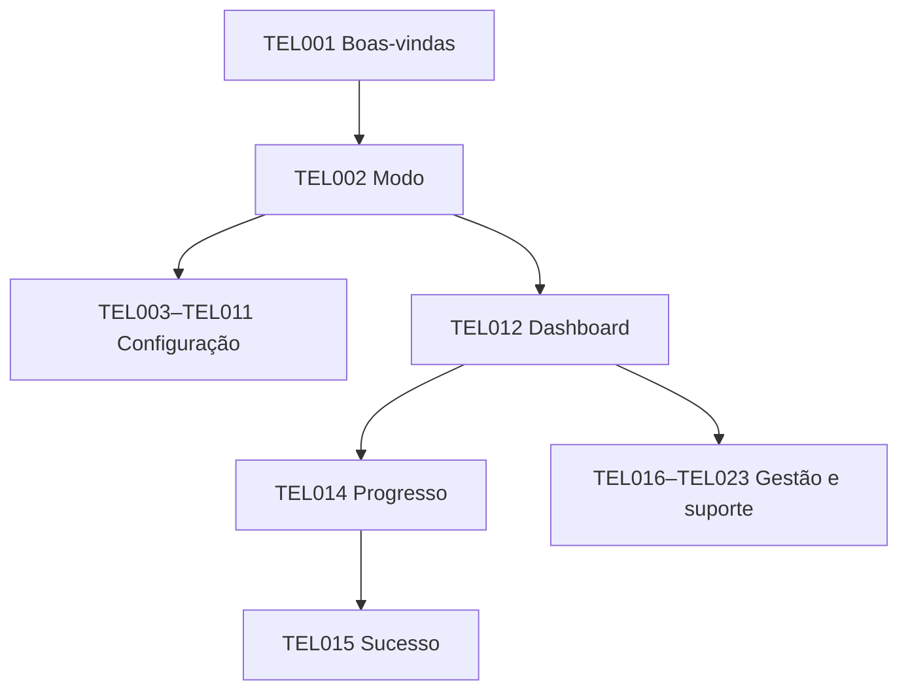

# Telas e fluxos

## Controle

Versão 1.1.0 — Estado: Aprovado — Data: 14/07/2026.

## Mapa de navegação

## Especificações

### TEL001 — Boas-vindas

| Campo | Especificação |
| --- | --- |
| Finalidade | Apresentar produto, privacidade e escolha de iniciar. |
| Atores | Técnico/Comum |
| Campos/conteúdo | Idioma; versão; resumo |
| Ações | Iniciar configuração; abrir launcher |
| Estados | primeiro uso; já configurado |
| Validações | não prosseguir sem aceitar aviso local |
| Mensagens de referência | Bem-vindo; seus dados ficam locais |
| Navegação | TEL002 ou TEL012 |
| Permissões | Todos; configuração exige técnico |
| Requisitos relacionados | RF006,RNF001 |

### TEL002 — Escolha de modo

| Campo | Especificação |
| --- | --- |
| Finalidade | Separar experiência comum e técnica. |
| Atores | Todos |
| Campos/conteúdo | Modo comum; modo técnico |
| Ações | Selecionar; voltar |
| Estados | com perfil; sem perfil |
| Validações | modo técnico exige confirmação/UAC só ao mutar |
| Mensagens de referência | Modo comum não altera configurações |
| Navegação | TEL003 ou TEL012 |
| Permissões | Comum/Técnico |
| Requisitos relacionados | RF006 |

### TEL003 — Diagnóstico em execução

| Campo | Especificação |
| --- | --- |
| Finalidade | Exibir coleta e progresso por categoria. |
| Atores | Técnico |
| Campos/conteúdo | Etapas; progresso; fonte; duração |
| Ações | Cancelar; ver detalhes |
| Estados | coletando; parcial; cancelado |
| Validações | cancelar não deixa mutação |
| Mensagens de referência | Coletando dados, sem alterar o computador |
| Navegação | TEL004 |
| Permissões | Técnico |
| Requisitos relacionados | RF001,RF002 |

### TEL004 — Resultado do diagnóstico

| Campo | Especificação |
| --- | --- |
| Finalidade | Mostrar evidências, confiança e classificação. |
| Atores | Técnico |
| Campos/conteúdo | Sistema; adaptador; energia; WoL; pendências |
| Ações | Corrigir; exportar; continuar |
| Estados | provável; incompatível; inconclusivo; incompleto |
| Validações | validado somente com teste real |
| Mensagens de referência | O driver sugere suporte; ainda falta testar |
| Navegação | TEL005/TEL006/TEL020 |
| Permissões | Técnico/Avançado |
| Requisitos relacionados | RF003,RF004 |

### TEL005 — Plano de alterações Windows

| Campo | Especificação |
| --- | --- |
| Finalidade | Obter consentimento por ação e executar com rollback. |
| Atores | Técnico |
| Campos/conteúdo | Ação; atual; proposto; risco; rollback |
| Ações | Selecionar; aplicar; restaurar |
| Estados | pronto; aplicando; parcial; revertido |
| Validações | snapshot obrigatório |
| Mensagens de referência | O Windows solicitará permissão para estas ações |
| Navegação | TEL006/TEL021 |
| Permissões | Técnico |
| Requisitos relacionados | RF006-RF008 |

### TEL006 — BIOS guiada

| Campo | Especificação |
| --- | --- |
| Finalidade | Orientar firmware por fabricante. |
| Atores | Técnico |
| Campos/conteúdo | Fabricante; nomes possíveis; checklist |
| Ações | Marcar concluído/não localizado/adiar |
| Estados | específico; genérico; pendente |
| Validações | não afirmar alteração automática |
| Mensagens de referência | Esta etapa acontece fora do aplicativo |
| Navegação | TEL007/TEL004 |
| Permissões | Técnico |
| Requisitos relacionados | RF005 |

### TEL007 — Configuração da VPN

| Campo | Especificação |
| --- | --- |
| Finalidade | Detectar e validar Tailscale. |
| Atores | Técnico |
| Campos/conteúdo | Instalação; autenticação; estado; nome do node |
| Ações | Instalar; autenticar; verificar |
| Estados | ausente; desconectado; conectado |
| Validações | não coletar auth key |
| Mensagens de referência | Conclua a autenticação no navegador |
| Navegação | TEL008 |
| Permissões | Técnico |
| Requisitos relacionados | RF009 |

### TEL008 — Preparação do Android

| Campo | Especificação |
| --- | --- |
| Finalidade | Guiar Termux/Boot/OpenSSH e bateria. |
| Atores | Técnico |
| Campos/conteúdo | Checklist; QR; origem; boot; health |
| Ações | Abrir etapa; verificar; retomar |
| Estados | incompleto; reiniciando; saudável; risco |
| Validações | origens de assinatura compatíveis |
| Mensagens de referência | Mantenha o celular conectado à energia |
| Navegação | TEL009 |
| Permissões | Técnico |
| Requisitos relacionados | RF010 |

### TEL009 — Pareamento seguro

| Campo | Especificação |
| --- | --- |
| Finalidade | Exibir código e fingerprints SSH/mTLS. |
| Atores | Técnico |
| Campos/conteúdo | Código; expiração; fingerprint SSH; fingerprints dos certificados do agente e launcher; dispositivos |
| Ações | Gerar; confirmar; cancelar |
| Estados | aguardando; divergente; expirado; concluído |
| Validações | uso único e 10 min |
| Mensagens de referência | Confirme que os códigos são iguais |
| Navegação | TEL010 |
| Permissões | Técnico |
| Requisitos relacionados | RF011,RF012 |

### TEL010 — Teste ponta a ponta

| Campo | Especificação |
| --- | --- |
| Finalidade | Executar e medir validação real. |
| Atores | Técnico |
| Campos/conteúdo | Estado S3/S4/S5; etapas; tempos; evidências |
| Ações | Iniciar; cancelar; repetir |
| Estados | preparando; ativando; pronto; falhou |
| Validações | consentimento antes de estado de energia |
| Mensagens de referência | Tenha acesso físico de contingência |
| Navegação | TEL011/TEL018 |
| Permissões | Técnico |
| Requisitos relacionados | RF024 |

### TEL011 — Conclusão da configuração

| Campo | Especificação |
| --- | --- |
| Finalidade | Resumir prontidão e pendências. |
| Atores | Técnico |
| Campos/conteúdo | Classificação; dispositivos; app; riscos |
| Ações | Concluir; exportar; revisar |
| Estados | validado; provável; incompleto |
| Validações | não habilitar comum se crítico pendente |
| Mensagens de referência | Configuração pronta para uso |
| Navegação | TEL012 |
| Permissões | Técnico |
| Requisitos relacionados | RF024,RF026 |

### TEL012 — Dashboard

| Campo | Especificação |
| --- | --- |
| Finalidade | Mostrar nome/estado e ação principal. |
| Atores | Comum |
| Campos/conteúdo | Nome do PC; PC; bridge; app; última verificação |
| Ações | Ligar e conectar; atualizar; ajuda |
| Estados | verificando; offline; pronto; bloqueado |
| Validações | botão desabilitado com motivo |
| Mensagens de referência | Computador principal: Desligado |
| Navegação | TEL014/TEL015/TEL018 |
| Permissões | Comum |
| Requisitos relacionados | RF015-RF017 |

### TEL013 — Aplicativo remoto

| Campo | Especificação |
| --- | --- |
| Finalidade | Configurar RustDesk/personalizado. |
| Atores | Técnico/Avançado |
| Campos/conteúdo | Preset; caminho; health probe; argumentos |
| Ações | Localizar; testar; salvar |
| Estados | válido; ausente; alterado; falhou |
| Validações | sem shell/argumento livre |
| Mensagens de referência | Executável não corresponde ao configurado |
| Navegação | TEL012/TEL016 |
| Permissões | Técnico/Avançado |
| Requisitos relacionados | RF014 |

### TEL014 — Progresso de ativação

| Campo | Especificação |
| --- | --- |
| Finalidade | Exibir fases e cancelamento. |
| Atores | Comum |
| Campos/conteúdo | Linha do tempo; fase; tempo; tentativa |
| Ações | Cancelar; manter em segundo plano |
| Estados | enviando; iniciando; Windows; serviço |
| Validações | sem retry após cancelar |
| Mensagens de referência | Ligando o computador… |
| Navegação | TEL015/TEL018 |
| Permissões | Comum |
| Requisitos relacionados | RF017-RF020,RF023 |

### TEL015 — Sucesso e abertura

| Campo | Especificação |
| --- | --- |
| Finalidade | Confirmar prontidão e abrir cliente. |
| Atores | Comum |
| Campos/conteúdo | PC pronto; app; duração |
| Ações | Abrir novamente; fechar |
| Estados | abrindo; aberto; falha de processo |
| Validações | somente após health |
| Mensagens de referência | RustDesk disponível. Abrindo… |
| Navegação | TEL012/TEL018 |
| Permissões | Comum |
| Requisitos relacionados | RF021 |

### TEL016 — Configurações

| Campo | Especificação |
| --- | --- |
| Finalidade | Ajustar opções não sensíveis. |
| Atores | Avançado |
| Campos/conteúdo | timeouts permitidos; app; notificações |
| Ações | Editar; restaurar padrão; salvar |
| Estados | válido; rascunho; conflito |
| Validações | faixas fechadas e validação |
| Mensagens de referência | Valor fora do intervalo permitido |
| Navegação | TEL013/TEL017/TEL019 |
| Permissões | Avançado |
| Requisitos relacionados | RF014,RF023 |

### TEL017 — Dispositivos autorizados

| Campo | Especificação |
| --- | --- |
| Finalidade | Listar e revogar dispositivos. |
| Atores | Técnico/Avançado |
| Campos/conteúdo | Nome; fingerprint curta; estado; último uso |
| Ações | Revogar; reparar |
| Estados | ativo; revogado; pendente |
| Validações | confirmar impacto |
| Mensagens de referência | Este dispositivo não poderá mais ligar o PC |
| Navegação | TEL009/TEL012 |
| Permissões | Técnico/Avançado |
| Requisitos relacionados | RF027 |

### TEL018 — Falha acionável

| Campo | Especificação |
| --- | --- |
| Finalidade | Traduzir erro e oferecer próxima ação. |
| Atores | Todos |
| Campos/conteúdo | Código; resumo; ação; correlation ID |
| Ações | Tentar novamente; ajuda; detalhes |
| Estados | VPN; bridge; wake; Windows; app; desconhecido |
| Validações | não expor stack/segredo |
| Mensagens de referência | Não foi possível alcançar o celular de ativação |
| Navegação | Origem ou TEL019 |
| Permissões | Por perfil |
| Requisitos relacionados | RF022 |

### TEL019 — Logs e suporte

| Campo | Especificação |
| --- | --- |
| Finalidade | Filtrar eventos e iniciar exportação. |
| Atores | Técnico/Suporte |
| Campos/conteúdo | Tempo; nível; componente; código; correlação |
| Ações | Filtrar; copiar ID; exportar |
| Estados | normal; degradado; retenção |
| Validações | mascaramento obrigatório |
| Mensagens de referência | Os detalhes técnicos não contêm senhas |
| Navegação | TEL020 |
| Permissões | Técnico/Avançado |
| Requisitos relacionados | RF025 |

### TEL020 — Exportar diagnóstico

| Campo | Especificação |
| --- | --- |
| Finalidade | Pré-visualizar dados e consentir. |
| Atores | Todos |
| Campos/conteúdo | Período; categorias; máscaras; destino |
| Ações | Gerar; excluir categoria; cancelar |
| Estados | prévia; verificando; pronto; bloqueado |
| Validações | scanner de segredos limpo |
| Mensagens de referência | Revise os dados antes de compartilhar |
| Navegação | TEL019/TEL012 |
| Permissões | Comum sanitizado; Técnico completo sem segredo |
| Requisitos relacionados | RF026 |

### TEL021 — Restauração

| Campo | Especificação |
| --- | --- |
| Finalidade | Comparar snapshot e restaurar. |
| Atores | Técnico/Avançado |
| Campos/conteúdo | Snapshot; diferença; itens; integridade |
| Ações | Selecionar; restaurar; repetir pendência |
| Estados | pronto; conflitante; parcial; concluído |
| Validações | não sobrescrever externo sem decisão |
| Mensagens de referência | Uma configuração mudou fora do aplicativo |
| Navegação | TEL005/TEL023 |
| Permissões | Técnico/Avançado |
| Requisitos relacionados | RF029 |

### TEL022 — Atualização

| Campo | Especificação |
| --- | --- |
| Finalidade | Mostrar versão, assinatura e rollback. |
| Atores | Técnico/Avançado |
| Campos/conteúdo | Atual; nova; notas; assinatura; compatibilidade |
| Ações | Baixar; instalar; adiar |
| Estados | disponível; inválida; instalando; revertida |
| Validações | canal estável exige assinatura |
| Mensagens de referência | A atualização não pôde ser verificada |
| Navegação | TEL012 |
| Permissões | Técnico/Avançado |
| Requisitos relacionados | RF028 |

### TEL023 — Desinstalação

| Campo | Especificação |
| --- | --- |
| Finalidade | Revogar, restaurar e remover com resumo. |
| Atores | Técnico/Avançado |
| Campos/conteúdo | Componentes; bridge; logs; snapshots |
| Ações | Restaurar; apagar/preservar; desinstalar |
| Estados | pronto; pendência offline; removendo; concluído |
| Validações | confirmação final e UAC |
| Mensagens de referência | O celular está offline; remova a autorização depois |
| Navegação | Fim |
| Permissões | Técnico/Avançado |
| Requisitos relacionados | RF030 |

## Regras de UX

* Ação primária única por tela; detalhes avançados em expansão.
* Estados usam texto, ícone e cor.
* Foco segue título/erro; progresso é anunciado por leitor de tela sem excesso.
* Confirmação destrutiva nomeia objeto e consequência.
* MAC, IP, porta e fingerprints completos não aparecem na experiência comum.
* Erros mostram: o que ocorreu, o que não ocorreu, ação segura e correlation ID.
