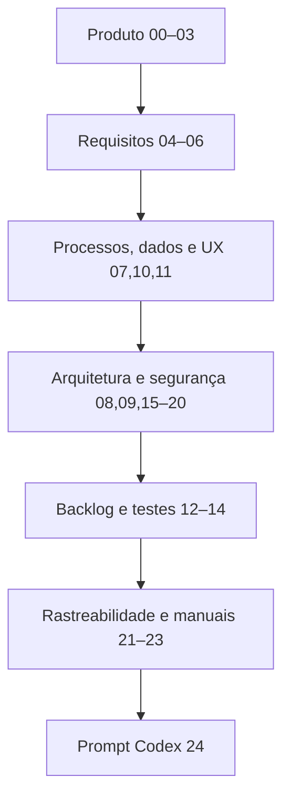

# Documentação — Remote Wake Assistant

## Objetivo

Esta documentação especifica integralmente o produto, processos, arquitetura, segurança, experiência, implementação e operação do Remote Wake Assistant. Ela é normativa para o MVP e deve ser lida antes de alterar código.

## Versão

Baseline documental 1.1.0 — 14 de julho de 2026.

## Índice e estados

| Documento | Conteúdo | Estado |
| --- | --- | --- |
| [00-briefing.md](00-briefing.md) | Briefing | Aprovado com ajustes pontuais |
| [01-visao-do-produto.md](01-visao-do-produto.md) | Visão do produto | Aprovado |
| [02-personas.md](02-personas.md) | Personas | Aprovado |
| [03-escopo-mvp.md](03-escopo-mvp.md) | Escopo do MVP | Aprovado |
| [04-requisitos-funcionais.md](04-requisitos-funcionais.md) | Requisitos funcionais | Aprovado |
| [05-requisitos-nao-funcionais.md](05-requisitos-nao-funcionais.md) | Requisitos não funcionais | Aprovado |
| [06-regras-de-negocio.md](06-regras-de-negocio.md) | Regras de negócio | Aprovado |
| [07-modelagem-dados.md](07-modelagem-dados.md) | Modelagem de dados | Aprovado |
| [08-arquitetura.md](08-arquitetura.md) | Arquitetura | Aprovado |
| [09-interfaces-e-integracoes.md](09-interfaces-e-integracoes.md) | Interfaces e integrações | Aprovado |
| [10-telas-e-fluxos.md](10-telas-e-fluxos.md) | Telas e fluxos | Aprovado |
| [11-wireframes.md](11-wireframes.md) | Wireframes | Aprovado com ajustes pontuais |
| [12-backlog.md](12-backlog.md) | Backlog | Aprovado |
| [13-plano-desenvolvimento.md](13-plano-desenvolvimento.md) | Plano de desenvolvimento | Aprovado |
| [14-plano-testes.md](14-plano-testes.md) | Plano de testes | Aprovado |
| [15-seguranca-e-privacidade.md](15-seguranca-e-privacidade.md) | Segurança e privacidade | Aprovado |
| [16-compatibilidade-e-diagnostico.md](16-compatibilidade-e-diagnostico.md) | Compatibilidade | Aprovado com ajustes pontuais |
| [17-instalacao-e-configuracao.md](17-instalacao-e-configuracao.md) | Instalação | Aprovado |
| [18-distribuicao-e-atualizacoes.md](18-distribuicao-e-atualizacoes.md) | Distribuição | Aprovado com ajustes pontuais |
| [19-observabilidade-e-suporte.md](19-observabilidade-e-suporte.md) | Observabilidade | Aprovado |
| [20-riscos-e-contingencias.md](20-riscos-e-contingencias.md) | Riscos | Aprovado com ajustes pontuais |
| [21-matriz-rastreabilidade.md](21-matriz-rastreabilidade.md) | Rastreabilidade | Aprovado |
| [22-manual-do-usuario.md](22-manual-do-usuario.md) | Manual do usuário | Aprovado |
| [23-manual-tecnico.md](23-manual-tecnico.md) | Manual técnico | Aprovado |
| [24-prompt-codex.md](24-prompt-codex.md) | Prompt de implementação | Aprovado |
| [processos/00-catalogo-de-processos.md](processos/00-catalogo-de-processos.md) | PRC-001–PRC-022 | Aprovado |
| [adrs/README.md](adrs/README.md) | ADR-001–ADR-010 | Aprovado |
| [wireframes/](wireframes/) | WF-001–WF-006 | Aprovado com ajustes pontuais |

Estados permitidos: Em elaboração; Aprovado; Aprovado com ajustes pontuais; Revisar; Obsoleto.

## Ordem de leitura

1. Produto: 00–03.
2. Comportamento: 04–06 e processos.
3. Dados/experiência: 07, 10 e 11.
4. Solução: 08, 09, ADRs e 15–20.
5. Execução: 12–14 e 21.
6. Operação: 22 e 23.
7. Implementação por agente: 24, somente após todos os anteriores.

## Convenções

* Linguagem declarativa; “deve” é normativo.
* [PENDENTE DE DECISÃO] bloqueia apenas o marco indicado.
* [PREMISSA PROVISÓRIA] exige risco até confirmação.
* Datas/telemetria em UTC; interface em pt-BR.
* Fontes oficiais sustentam comportamento externo; teste real sustenta compatibilidade do equipamento.

## Identificadores

| Prefixo | Tipo |
| --- | --- |
| OBJ | Objetivo |
| PER | Persona |
| RF | Requisito funcional |
| RNF | Requisito não funcional |
| RN | Regra de negócio |
| PRC | Processo |
| TEL | Tela |
| INT | Integração |
| CMP | Componente |
| ADR | Decisão arquitetural |
| RSK | Risco |
| US | História |
| CT | Critério/caso de teste |
| ERR | Código de erro |
| WF | Wireframe |

## Decisões principais

Local-first; .NET 10 LTS/WPF; Tailscale; Termux bridge temporário; SSH pinned/forced command; ReadinessAgent HTTPS/mTLS; SQLite+DPAPI; privilégio separado; máquina de estados; MSI/WiX assinado.

## Decisão resolvida nesta versão

O protocolo do ReadinessAgent foi definido no ADR-010: HTTPS/1.1 JSON sobre Tailscale, mTLS com certificados fixados por dispositivo, API somente leitura e firewall restrito. RSK021 e SPK003 foram encerrados. O nome comercial definitivo permanece pendente sem bloquear implementação.

## Dependências

## Governança

Mudança material atualiza requisito, regra, processo/tela, ADR quando arquitetural, risco, teste e matriz. Não apagar histórico de ADR. Nenhuma credencial entra na documentação ou no repositório.
